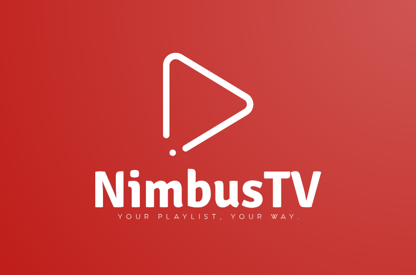

# NimbusTV 🌐📺: Your Gateway to Effortless M3U Streaming on Android TV

Welcome to **NimbusTV** 🎉, your all-in-one solution for experiencing M3U playlist content on Android TV without the usual hassle. Designed with simplicity and power in mind, NimbusTV lets you forget about complicated setups and file management, making it easy to dive straight into your favorite channels 📺✨.

With NimbusTV, you can effortlessly manage multiple M3U playlists 📂, giving you the freedom to organize your channels by theme—sports 🏆, movies 🎬, news 📰, music 🎶, and more. Switch seamlessly between playlists and enjoy diverse formats with support for HLS 📡, DASH 🎥, Clear Key-encrypted channels 🔐, and even radio streams 📻.

NimbusTV doesn’t stop at playlists. Bringing in EPGs 📅 for each of your channels, it keeps you informed with real-time programming schedules. Imagine instantly knowing what’s on, what’s up next, and never having to wonder if you've missed a must-watch show 🕒. Set custom reminders 🔔 for your favorite programs, so you’ll always be in the know when the action begins!

Crafted with **Jetpack Compose for TV** 🖥️, NimbusTV shines on the big screen, delivering a smooth, elegant experience for Android TV. Built on the reliable **Clean Architecture** 🧩 and **MVI** pattern foundations, it’s designed to be fast, scalable, and visually immersive. Thanks to the [**🍮 Fudge**](https://github.com/sergio11/fudge_tv_compose_library) UI Kit, NimbusTV combines a sleek design with easy navigation, putting total control in your hands 🎛️.

A big thank you to the [JetFit](https://github.com/TheChance101/tv-samples/tree/JetFit/JetFit) repository for inspiring NimbusTV with a solid base for Jetpack Compose for TV 🛠️.

Explore NimbusTV today, and bring a world of channels right to your living room—effortless, organized, and always ready when you are. 🌐✨📺

## 🎯 Key Features

- **Simple Setup** 🛠️  
  Effortlessly add and manage your M3U playlists with NimbusTV’s clean and intuitive interface. No more complicated configurations!

- **Seamless Playback** 🎥  
  Enjoy smooth and uninterrupted playback of your M3U content directly on your Android TV. Say goodbye to buffering and enjoy your content in the best quality possible.

- **Channel Management** 📺  
  Easily browse and switch between channels in your playlists. NimbusTV provides a user-friendly navigation system that makes finding and switching channels a breeze.

- **User-Friendly Interface** 🖥️  
  Designed specifically for Android TV, NimbusTV features a clean and responsive interface that is easy to navigate with your remote control.

## 🚀 Why Choose NimbusTV?

- **Effortless Experience**: Simplifies how you manage and enjoy your M3U playlists on Android TV.
- **Optimized for TV**: Built with Jetpack Compose to ensure a smooth and responsive experience on your Android TV device.
- **No Hassles**: Say goodbye to frustrating setup processes and manual file management. NimbusTV gets you streaming quickly and easily.

## 🎬 Get Started

Transform your Android TV experience with **NimbusTV**. Download the app, set up your M3U playlists, and start enjoying endless entertainment—effortlessly and without interruption.
