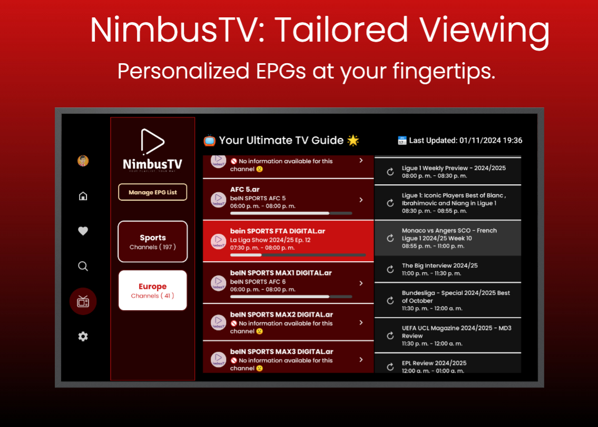
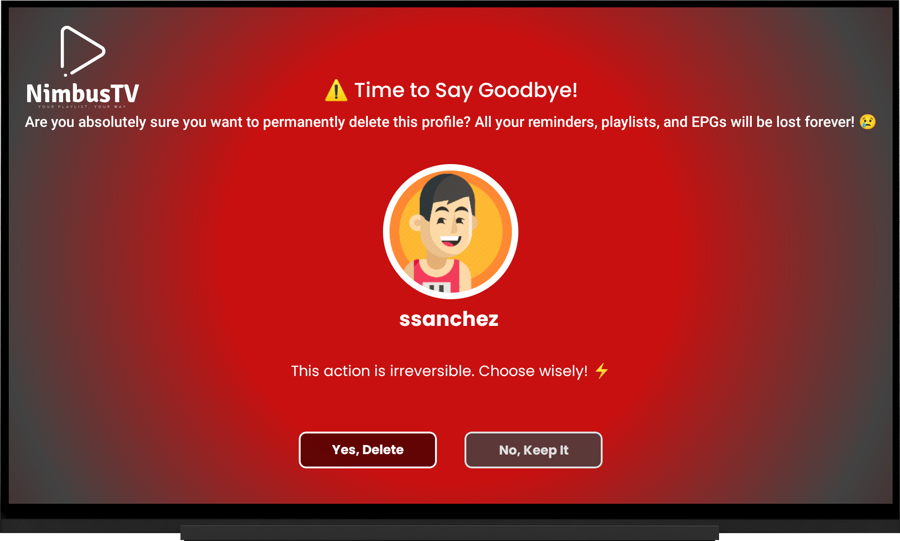

# NimbusTV 🌐📺: Your Gateway to Effortless M3U Streaming on Android TV


Welcome to **NimbusTV** 🎉, your all-in-one solution for experiencing M3U playlist content on Android TV without the usual hassle. Designed with simplicity and power in mind, NimbusTV lets you forget about complicated setups and file management, making it easy to dive straight into your favorite channels 📺✨.

With NimbusTV, you can effortlessly manage multiple M3U playlists 📂, giving you the freedom to organize your channels by theme—sports 🏆, movies 🎬, news 📰, music 🎶, and more. Switch seamlessly between playlists and enjoy diverse formats with support for HLS 📡, DASH 🎥, Clear Key-encrypted channels 🔐, and even radio streams 📻.

NimbusTV doesn’t stop at playlists. Bringing in EPGs 📅 for each of your channels, it keeps you informed with real-time programming schedules. Imagine instantly knowing what’s on, what’s up next, and never having to wonder if you've missed a must-watch show 🕒. Set custom reminders 🔔 for your favorite programs, so you’ll always be in the know when the action begins!

Crafted with **Jetpack Compose for TV** 🖥️, NimbusTV shines on the big screen, delivering a smooth, elegant experience for Android TV. Built on the reliable **Clean Architecture** 🧩 and **MVI** pattern foundations, it’s designed to be fast, scalable, and visually immersive. Thanks to the [**🍮 Fudge**](https://github.com/sergio11/fudge_tv_compose_library) UI Kit, NimbusTV combines a sleek design with easy navigation, putting total control in your hands 🎛️.

A big thank you to the [JetFit](https://github.com/TheChance101/tv-samples/tree/JetFit/JetFit) repository for inspiring NimbusTV with a solid base for Jetpack Compose for TV 🛠️.

Explore NimbusTV today, and bring a world of channels right to your living room—effortless, organized, and always ready when you are. 🌐✨📺

<p align="center">
  
  
  
  
</p>

<p align="center">
  
  
  
  
  
</p>

Slides are built using the  template from [Previewed](https://previewed.app/template/AFC0B4CB). I extend my gratitude to them for their remarkable work and contribution.

### About Playlist and EPG Sources

For demonstration and testing purposes, **NimbusTV** utilizes publicly available IPTV playlists from the [IPTV-Org](https://iptv-org.github.io/) project. These playlists offer a diverse collection of international channels in M3U format, enabling users to explore and experience a wide range of content directly from the app.

To handle M3U playlist parsing, we’ve integrated and customized the [M3u parser](https://github.com/BjoernPetersen/m3u-parser) library. Modifications were made to extend the functionality, allowing NimbusTV to support even more complex M3U structures, while accommodating the varied and sometimes inconsistent formats found in IPTV playlists.

Explore NimbusTV today, and bring a world of channels right to your living room—effortless, organized, and always ready when you are. 🌐✨📺

## Overview 🌐

NimbusTV is designed to transform the way users experience content on their Android TVs, offering an all-encompassing, intuitive platform that boasts a wide range of features tailored to enhance user satisfaction and engagement.

<p align="center">
  
</p>

### Features ✨

- **Multi-Playlist Management** 📃: 
  - Users can easily manage multiple M3U playlists, allowing them to create, edit, and organize channels by themes, genres, or personal preferences. This feature ensures quick access to favorite content without the hassle of searching through extensive lists, making content discovery smooth and enjoyable.

- **Diverse Playback Options** 📺:
  - NimbusTV supports a variety of streaming formats, including HLS (HTTP Live Streaming), DASH (Dynamic Adaptive Streaming over HTTP) with clear keys, and internet radio. This flexibility ensures users can enjoy a wide range of content, from live TV broadcasts to on-demand streaming and radio stations, all with high-quality playback tailored to their internet connection.

- **EPG Importation** 📅:
  - Users can import Electronic Program Guides (EPGs) seamlessly into NimbusTV. This feature provides access to detailed programming information for all favorite channels, allowing users to see what’s currently airing, upcoming shows, and special events. The EPG importation enhances the viewing experience by helping users plan their watching schedules effectively.

- **Reminders** ⏰:
  - With customizable reminders, users can set alerts for upcoming shows or events. This feature ensures that users never miss their favorite programs, as they will receive timely notifications based on their personalized schedules. It adds convenience, allowing users to enjoy their content without the worry of forgetting about upcoming broadcasts.

- **User Profiles** 👤:
  - NimbusTV allows for the creation of personalized user profiles, enabling each family member or user to have their own distinct viewing experience. Each profile maintains unique playlists, EPGs, and preferences, fostering an independent content management system that caters to the diverse tastes and viewing habits of different users.

- **Secure Access** 🔒:
  - User privacy is a top priority in NimbusTV. Profiles are stored securely, with an optional PIN for access, ensuring that personal data and preferences remain protected. This feature enhances user trust, allowing them to enjoy their content with peace of mind regarding their security.

- **Dynamic Viewing Modes** 📺:
  - Users can switch between various EPG viewing modes, such as "Channel Overview," which provides a broad view of available channels, or "Now and Schedule," which displays currently airing programs and upcoming shows. This dynamic feature allows users to customize their viewing experience based on their preferences and the type of content they wish to explore.

- **Enhanced Search Functionality** 🔍:
  - NimbusTV includes a powerful search feature that enables users to quickly find channels, shows, or genres. This enhanced search capability streamlines navigation within the app, making it easier for users to discover new content or revisit their favorites without unnecessary delays.

NimbusTV is committed to providing an enriching, user-friendly experience that meets the diverse needs of its users while transforming their living room into an entertainment hub. With its extensive features and intuitive interface, NimbusTV is your go-to platform for all things streaming! 🌟

<p align="center">
  
</p>


## Technologies Used 🛠️

NimbusTV harnesses a variety of technologies to deliver a seamless streaming experience on Android TV. 🌟

- **Kotlin** 🦺: The preferred language for developing Android applications, offering modern syntax and powerful features to enhance productivity. 🚀

- **Room** 🗄️: Implements a local database schema to persist information about M3U playlists, channels, EPG data, and program entries linked to each user profile. Each user profile in NimbusTV maintains its own independent playlists and EPGs, ensuring personalized content management. 🔐📂

- **Jetpack DataStore** 💾: A modern data storage solution used to store application preferences shared across profiles. It allows users to enable different EPG viewing modes, such as "Channel Overview" or "Now and Schedule," and activate channel search options. 🔍✨

- **Coil** 🖼️: An image loading library for Android that simplifies the process of loading images from the internet, ensuring smooth and efficient image handling in the app. 📸🌐

- **WorkManager** 🕰️: Used to schedule background tasks, such as updating EPG data daily and sending reminders for upcoming shows, ensuring that users never miss their favorite content. 📅⏰

- **Coroutines** 🌀: Simplifies asynchronous programming and efficiently manages background tasks, enhancing app responsiveness. ⏱️⚡

- **Clean Architecture** 🏗️: Promotes a well-structured and scalable app design by separating concerns into distinct layers, enhancing maintainability and testability. 🔍

- **MVI (Model-View-Intent)** 📈: Implements a unidirectional data flow pattern, ensuring a clear separation between UI components and business logic. 🔄

- **Jetpack Compose for TV** 📺: Utilizes Jetpack Compose to build modern, responsive UIs tailored for TV screens, optimizing the interface for large displays. 🎨

- **Jetpack Compose Navigation** 🗺️: Facilitates in-app navigation and screen transitions with a clear API, supporting deep linking and complex navigation flows effortlessly. 🚦

- **Material Design 3** 🎨: Applies the latest Material Design guidelines to create a visually appealing and intuitive user interface. 🖌️

- **🍮 Fudge** 🍰: Fudge is a Jetpack Compose UI Kit for TV apps, providing pre-built components and tools to craft engaging experiences on the big screen. 🎬🚀

- **Media3 for Media Playback** 🎥: 
  - **Media3 ExoPlayer** 🎬: Part of the Media3 library, ExoPlayer supports various media formats, providing advanced features for high-quality playback. 📻🍿
    - **HLS (HTTP Live Streaming)** 📺: This plugin allows the playback of HLS streams, enabling adaptive streaming for different network conditions. It dynamically adjusts the quality of the video based on the user's internet speed, ensuring smooth playback with minimal buffering. 🎥🌐
    - **DASH (Dynamic Adaptive Streaming over HTTP)** 📡: This plugin enables the playback of DASH streams, another adaptive streaming format. Similar to HLS, DASH adjusts video quality in real-time, providing a seamless viewing experience by optimizing bandwidth usage and improving playback performance. 📺⚡
  - **Media3 UI** 🎨: Provides UI components for integrating media playback controls into your app’s interface. 🕹️🎶

- **Dagger Hilt** 🧩: A dependency injection library simplifying the management of dependencies and enhancing modularity in your app. 🔧💡

- **Mapper Pattern** 🔄: Facilitates conversion between different data models, ensuring data consistency across application components. 📐

## Architecture Overview 🏛️

NimbusTV is designed with a robust architecture for maintainability, testability, and flexibility. The architecture leverages several design patterns and principles:

### **Clean Architecture**  
Clean Architecture focuses on separating concerns into distinct layers:
- **Presentation Layer**: Handles UI and user interactions using Jetpack Compose for modern interfaces. 🖥️✨
- **Domain Layer**: Contains business logic and use cases, independent of external frameworks. 🧠🔗
- **Data Layer**: Manages data sources and repositories, abstracting data retrieval and storage. 📦🔒

### **Data Sources**  
Data sources fetch and manage data from various origins, including:
- **Remote Data Sources** 🌐: Interact with cloud services or web APIs (e.g., Firebase Firestore). ☁️🔄
- **Local Data Sources** 💻: Handle local data storage (e.g., Room and Jetpack DataStore). 💾🗃️

### **Repository Pattern**  
The repository pattern provides a unified interface for data access, decoupling data retrieval from the rest of the application for easier testing and maintenance. 📚⚙️

### **Use Cases**  
In the Domain Layer, Use Cases represent specific actions, encapsulating business logic and interacting with repositories to retrieve or modify data. 🧩🔍

### **Inversion of Control (IoC)** 🔄  
IoC inverts control flow, allowing dependencies to be injected rather than hardcoded, promoting modularity and reducing boilerplate code. 🔧🔄

### **SOLID Principles** 📏 
We apply SOLID principles to ensure our codebase remains clean and maintainable:
- **Single Responsibility Principle (SRP)** ✅: Each class has one responsibility. 
- **Open/Closed Principle (OCP)** 🔓: Classes are open for extension but closed for modification. 
- **Liskov Substitution Principle (LSP)** 🔄: Subtypes must be substitutable for their base types. 
- **Interface Segregation Principle (ISP)** 🚫: Clients should not depend on interfaces they do not use. 
- **Dependency Inversion Principle (DIP)** 📏: High-level modules depend on abstractions.

### **MVI (Model-View-Intent)** 📈  
MVI manages state and interactions, ensuring a predictable unidirectional data flow. 🔄📊

This architecture ensures that NimbusTV is well-structured, easy to maintain, and scalable, adhering to best practices and design principles. 🌈✨

## App Screenshots 📸

Discover **NimbusTV** and its intuitive design with these screenshots, giving you a glimpse into the app’s key features!

### Onboarding and Getting Started 🎬

Begin your experience on **NimbusTV** by creating a profile. This first step is all about setting up a unique space for your favorite EPGs and playlists. No need for online accounts or login—everything is managed locally for a standalone experience. Start organizing your content right away!

<p align="center">
  
</p>

<p align="center">
  
</p>

<p align="center">
  
</p>

### Managing Your Profiles 👤

Step into the **Profiles** section, where you can customize **NimbusTV** to suit your viewing preferences. Here’s what makes the Profiles section so versatile:

<p align="center">
  
</p>

- **Profile Selection**: Choose between different profiles in the **Profile Selection** screen. Each profile allows for custom EPGs and playlists, ensuring a unique setup for each viewer.

<p align="center">
  
</p>

<p align="center">
  
</p>

- **Creating Profiles**: Add up to four profiles, perfect for household members who want their own playlists and EPGs. Customize each with a unique name and avatar, making NimbusTV adaptable and fun for everyone!

<p align="center">
  
</p>  

<p align="center">
  
</p>  

<p align="center">
  
</p>  

- **Editing Profiles**: Update profile details, including name, avatar, and security PIN, all while keeping your data secure and your experience personalized.

<p align="center">
  
</p>  

<p align="center">
  
</p>  

- **Deleting Profiles**: When a profile is no longer needed, delete it to keep **NimbusTV** clean and focused on what matters most.

<p align="center">
  
</p>  

<p align="center">
  
</p>  

The **Profiles** section makes NimbusTV adaptable to every user’s viewing needs, ensuring a personalized experience on a single device.

<p align="center">
  
</p>  

### Home Screen 🏠📺

Welcome to the **Home** screen of **NimbusTV**, your central hub for exploring and enjoying your playlists and channels:

<p align="center">
  
</p>

<p align="center">
  
</p>

<p align="center">
  
</p>

- **Channel Preview** 🔍: Hover over any channel to get a quick preview of what's currently playing—ideal for browsing without fully tuning in.

- **Favorites** ⭐: Mark your favorite channels to keep them easily accessible for quick viewing.

- **Smooth Playlist Switching** 🔄: Effortlessly switch between playlists to explore channels organized by theme or preference, perfect if you like variety.

<p align="center">
  
</p>

<p align="center">
  
</p>

- **Playlist Management** 🎛️: From the main screen, access the **Manage Playlist** button to open the playlist management view, where you can:
  - **Add New Playlists** ➕: Add new M3U playlists to expand your channel lineup.
  - **Delete Playlists** 🗑️: Remove playlists that are no longer needed.
  - **Update Playlists** 🔄: Refresh playlists to keep content up-to-date.
  - **Explore Channels and Favorites** 📋: View each playlist's channels, mark favorites, or play them instantly.
 
<p align="center">
  
</p>

<p align="center">
  
</p>

<p align="center">
  
</p>

<p align="center">
  
</p>

<p align="center">
  
</p>

<p align="center">
  
</p>

With NimbusTV’s **Home** screen, you’re in control of all your playlists and favorite channels, providing a fully personalized TV experience. 🎉

### Channel Search Screen 🔎📺

The **Channel Search** feature in **NimbusTV** is your go-to tool for quickly finding channels across all imported playlists! Accessible from the **Side Menu** (if enabled in **Preferences**), this screen allows you to:

- **Quickly Search Channels** 🔍: Type a keyword to search through all registered channels, making it easy to find exactly what you’re looking for in seconds.

- **Intuitive On-Screen Keyboard** ⌨️: Use the keyboard on the left side of the screen to input search terms, with the results instantly updating as you type.

- **Results Display** 📜: Found channels are shown in a convenient list on the right side of the screen. Browse through and explore results based on your search term.

- **Channel Actions** 💬: Selecting a channel in the search results opens a dialog with two options:
  - **Play Now** ▶️: Instantly tune in to the channel.
  - **Add to Favorites** ⭐: Save the channel for quick access from your favorites list.

<p align="center">
  
</p>

<p align="center">
  
</p>

<p align="center">
  
</p>

The **Channel Search** screen streamlines navigation and lets you customize your experience by finding and favoriting channels across your playlists.

### Favorites Section ⭐

The **Favorites** section in **NimbusTV** is designed for quick access to the channels you love most. Here’s what makes it a perfect tool for streamlining your viewing experience:

- **Easy Access to Favorites** 📜: Your favorite channels are all listed in one place, making it effortless to start watching right away.

- **Instant Playback** ▶️: Simply select a channel from the list to begin playback, no need to navigate through different playlists.

- **Manage Favorites** 🗑️: Want to declutter? Easily remove channels from your favorites list with a single action, keeping only the content you truly enjoy.

The **Favorites** section keeps your top channels just a click away, making it your personalized hub for entertainment on NimbusTV!

<p align="center">
  
</p>

<p align="center">
  
</p>


### EPG (Electronic Program Guide) 📅

The **Electronic Program Guide (EPG)** in **NimbusTV** lets each profile import, view, and manage channel lists and programming schedules. Here’s an overview of its key features:

<p align="center">
  
</p>

<p align="center">
  
</p>

#### EPG Viewing Modes 🎛️

**NimbusTV** offers two EPG display modes, configurable from **Settings**:

- **Now & Schedule Mode** ⏰:  
  This mode displays the EPG in a two-column format:
  - The first column shows all channels with their currently airing programs.
  - The second column lists the full schedule for each channel, indicating whether the event is past, live, or upcoming.  
  You can select any upcoming event to open a dialog and set a reminder, which will notify you 5 minutes before the show starts.

<p align="center">
  
</p>

<p align="center">
  
</p>

<p align="center">
  
</p>

<p align="center">
  
</p>

<p align="center">
  
</p>

<p align="center">
  
</p>

<p align="center">
  
</p>

- **Single-Column Mode** 📜:  
  This format organizes the EPG into a single column, with each channel appearing in an individual row alongside its full schedule for the day. Just like in **Now & Schedule Mode**, you can interact with events and set reminders for future shows.

<p align="center">
  
</p>

<p align="center">
  
</p>

<p align="center">
  
</p>

<p align="center">
  
</p>

Both modes provide intuitive navigation through each channel’s programming, making it quick and easy to keep track of your favorite shows.

#### EPG Source Management 🔧

Each profile can access **EPG Source Management**, where you can:

<p align="center">
  
</p>

- **Add New EPGs** ➕: Import custom EPG sources to load channel programming schedules.

<p align="center">
  
</p>

- **Delete Existing EPGs** 🗑️: Remove any EPG sources that you no longer need.

<p align="center">
  
</p>

- **Daily Auto-Updates** 🔄: NimbusTV schedules a daily update for each active EPG, refreshing programming data so you always have the latest information.

With these flexible options, each profile in **NimbusTV** can tailor its own program guide, ensuring a viewing experience that’s convenient and perfectly suited to your preferences. Stay organized, informed, and on top of your favorite channels’ schedules!

<p align="center">
  
</p>

### Full-Screen Player 🎥

The **Full-Screen Player** in **NimbusTV** provides an immersive viewing experience, allowing you to enjoy channels in full detail. Here’s what you can do within the player:

- **Full-Screen Playback** 📺: Each channel can be viewed in full-screen mode, giving you a clear and focused experience of your selected content.

- **Add to Favorites** ⭐: Want quick access to a channel? Add it to your favorites directly from the player screen with just one click.

- **Access System Settings** ⚙️: Open the system settings panel without leaving the player, allowing for quick adjustments to enhance your viewing experience.

#### Audio-Only Player for Music & Radio 📻

For music or radio channels, **NimbusTV** launches a special **Audio-Only Player**:

- **Music & Radio Display** 🎶: When tuning into a radio or music channel, the audio-only player displays station or channel information, delivering a streamlined audio experience without video, ideal for listening enjoyment.

With both full-screen video playback and an optimized audio-only mode, **NimbusTV**’s player is designed to adapt to your viewing and listening needs, making every channel as engaging as possible.


### Settings Screen ⚙️

The **Settings** screen in **NimbusTV** offers you a range of customizable options to tailor your viewing experience. Here’s how you can enhance your interaction with the app:

<p align="center">
  
</p>

### Channel Search Settings 🔍

The **Channel Search** option allows you to enable or disable the feature to search for channels across your playlists, providing you with flexibility in navigation.

- **Toggle Search Visibility** ⚙️: Enable or disable the channel search feature easily. When activated, the search icon will appear in the side menu, making it simple to find your favorite channels at any time.

<p align="center">
  
</p>

- **EPG View Mode Selection** 📅: Choose how you want to view the Electronic Program Guide (EPG). You can opt for a **"Now & Schedule"** format with two columns for an overview of what's currently airing and what's coming up, or a **unified format** with a single column displaying all programming for the current day in one row per channel.

<p align="center">
  
</p>

### Additional Settings 🛠️

- **Access AndroidTV Settings** 📱: Quickly navigate to the AndroidTV system settings for further customization and adjustments.

- **Legal Information** 📜: View essential documents like **Terms and Conditions**, ensuring you understand the usage of the app.

<p align="center">
  
</p>

- **Help Section** ❓: Need assistance? Access the help section for FAQs and troubleshooting tips to enhance your experience.

<p align="center">
  
</p>

- **About Us** ℹ️: Learn more about **NimbusTV** and our mission in the "About NimbusTV" section.

<p align="center">
  
</p>

- **Log Out** 🚪: Easily log out of your account when you’re done, ensuring your privacy and security.

<p align="center">
  
</p>

With these settings, **NimbusTV** empowers you to create a viewing environment that fits your preferences, making your entertainment experience as enjoyable as possible!

## Contribution
Contributions to NimbusTV Android are highly encouraged! If you're interested in adding new features, resolving bugs, or enhancing the project's functionality, please feel free to submit pull requests.

## Credits
NimbusTV is developed and maintained by Sergio Sánchez Sánchez (Dream Software). Special thanks to the open-source community and the contributors who have made this project possible. If you have any questions, feedback, or suggestions, feel free to reach out at dreamsoftware92@gmail.com.

## Acknowledgements 🙏

We express our deep appreciation to [Freepik](https://www.freepik.es/) for generously providing the resources used in this project.
<div> Icons and images takes from <a href="https://www.freepik.com" title="Freepik"> Freepik </a> from <a href="https://www.flaticon.es/" title="Flaticon">www.flaticon.es'</a></div>

A heartfelt thank you to the creators of the [JetFit repository](https://github.com/TheChance101/tv-samples/tree/JetFit/JetFit) for providing such an invaluable starting point for Jetpack Compose for TV. Your work has been incredibly inspiring and instrumental in shaping the development of this project.

The resources, examples, and insights provided in the JetFit repository served as a foundational reference, enabling us to build and expand upon your excellent groundwork. Your contributions have significantly accelerated our journey and enriched our understanding of creating seamless TV applications using Jetpack Compose. 📺✨

For demonstration and testing purposes, **NimbusTV** utilizes publicly available IPTV playlists from the [IPTV-Org](https://iptv-org.github.io/) project. These playlists offer a diverse collection of international channels in M3U format, enabling users to explore and experience a wide range of content directly from the app.

To handle M3U playlist parsing, we’ve integrated and customized the [M3u parser](https://github.com/BjoernPetersen/m3u-parser) library. Modifications were made to extend the functionality, allowing NimbusTV to support even more complex M3U structures, while accommodating the varied and sometimes inconsistent formats found in IPTV playlists.

## Visitors Count

 
 ## Please Share & Star the repository to keep me motivated.
  <a href = "https://github.com/sergio11/nimbustv_android/stargazers">
     
  </a>

## License ⚖️

This project is licensed under the MIT License, an open-source software license that allows developers to freely use, copy, modify, and distribute the software. 🛠️ This includes use in both personal and commercial projects, with the only requirement being that the original copyright notice is retained. 📄

Please note the following limitations:

- The software is provided "as is", without any warranties, express or implied. 🚫🛡️
- If you distribute the software, whether in original or modified form, you must include the original copyright notice and license. 📑
- The license allows for commercial use, but you cannot claim ownership over the software itself. 🏷️

The goal of this license is to maximize freedom for developers while maintaining recognition for the original creators.

```
MIT License

Copyright (c) 2024 Dream software - Sergio Sánchez 

Permission is hereby granted, free of charge, to any person obtaining a copy
of this software and associated documentation files (the "Software"), to deal
in the Software without restriction, including without limitation the rights
to use, copy, modify, merge, publish, distribute, sublicense, and/or sell
copies of the Software, and to permit persons to whom the Software is
furnished to do so, subject to the following conditions:

The above copyright notice and this permission notice shall be included in all
copies or substantial portions of the Software.

THE SOFTWARE IS PROVIDED "AS IS", WITHOUT WARRANTY OF ANY KIND, EXPRESS OR
IMPLIED, INCLUDING BUT NOT LIMITED TO THE WARRANTIES OF MERCHANTABILITY,
FITNESS FOR A PARTICULAR PURPOSE AND NONINFRINGEMENT. IN NO EVENT SHALL THE
AUTHORS OR COPYRIGHT HOLDERS BE LIABLE FOR ANY CLAIM, DAMAGES OR OTHER
LIABILITY, WHETHER IN AN ACTION OF CONTRACT, TORT OR OTHERWISE, ARISING FROM,
OUT OF OR IN CONNECTION WITH THE SOFTWARE OR THE USE OR OTHER DEALINGS IN THE
SOFTWARE.
```

